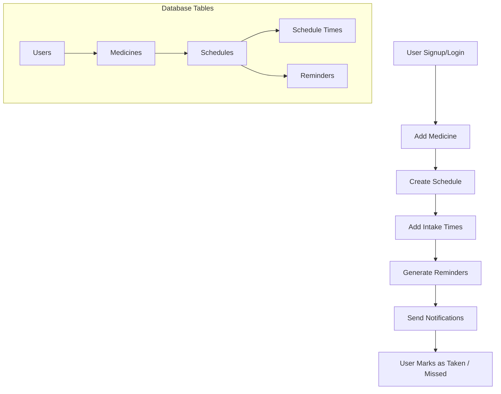

# 📌 Medicine Reminder App – Data Flow

This document explains how the medicine reminder system works, from user registration to reminder tracking.

---

## 🧩 Flow Breakdown

### 1. User Registration & Login

- Users create an account and log in.
- On login, the server issues a **JWT token**.
- All API requests require `Authorization: Bearer <token>`.

---

### 2. Add Medicine

**Endpoint:** `POST /medicines`

- Users add medicines with details like name, dosage, and instructions.
- Example payload:

```json
{
  "name": "Paracetamol",
  "description": "Pain reliever",
  "dosage": "1 pill",
  "instructions": "After meals"
}
```

---

### 3. Create Schedule

**Endpoint:** `POST /medicines/:id/schedules`

- Users define when and how often to take the medicine.
- Example payload:

```json
{
  "start_date": "2025-10-01",
  "end_date": "2025-10-07",
  "frequency": "daily",
  "times_per_day": 3
}
```

---

### 4. Add Intake Times

**Endpoint:** `POST /schedules/:id/times`

- Users specify exact times of the day (e.g., morning, afternoon, evening).
- Example payload:

```json
{ "intake_time": "08:00" }
```

---

### 5. Generate Reminders

- The system generates reminders based on schedule + times.
- Example SQL:

```sql
INSERT INTO reminders (schedule_id, reminder_datetime, status)
VALUES (1, '2025-10-01 08:00', 'pending');
```

---

### 6. Send Notifications

- App/backend checks:

```sql
SELECT * FROM reminders
WHERE status = 'pending' AND reminder_datetime <= NOW();
```

- Triggers push notifications or alerts for the user.

---

### 7. Track User Action

- When the user takes medicine, they mark it as **taken**:

```sql
UPDATE reminders
SET status = 'taken', taken_at = CURRENT_TIMESTAMP
WHERE reminder_id = ?;
```

- If not marked, reminder remains **pending/missed**.

---

## 🔄 Data Relationship

```
Users → Medicines → Schedules → Schedule Times → Reminders
```

- **Users** own medicines.
- **Medicines** define what drug is taken.
- **Schedules** define frequency & duration.
- **Schedule Times** define exact intake times.
- **Reminders** are the actionable events (pending/taken/missed).

---

✅ This flow ensures that each medicine has a structured timeline, and users are notified at the right times while tracking adherence.

---

#### Flow Chart in mermaid


